## A Quick Intro to Argo CD

In this tutorial we will go over how to get started with
[Argo CD](https://argo-cd.readthedocs.io/en/stable/).

If you're looking at Argo CD then I'm assuming your team already does
[GitOps](https://codefresh.io/docs/docs/ci-cd-guides/gitops-deployments/)
deployments or you're considering it. That is, your application definitions
and configurations are version controlled in Git, and you're looking for a
modern, straightforward and Kubernetes native service to manage and automate
your deployments. Argo CD was made to fulfill that role.

In this tutorial we will go over:

* Installing Argo CD
* Adding a simple application whose definition is in Git
* Deploying the application
* Modifying the application definition and re-deploying

By the end you will see how easy it is to get Argo CD setup and manage
application deployments with it.

---
### Prerequisites

It is assumed you are familiar with
[Kubernetes](https://kubernetes.io/docs/concepts/)
and are comfortable editing application definitions and configurations.

For this tutorial you will also need:

* A [GitHub](https://github.com/join) account
* A local Kubernetes cluster
* [kubectl](https://kubernetes.io/docs/tasks/tools/#kubectl) installed

If you do not have Kubernetes available locally and would like to install it
you can follow
[this guide](https://medium.com/containers-101/local-kubernetes-for-mac-minikube-vs-docker-desktop-f2789b3cad3a).

---
### Preparation

To start things off fork this repository in GitHub. A sample application is
included with the repository which we will use for the tutorial. Feel free to
look at configuration files.

<kbd>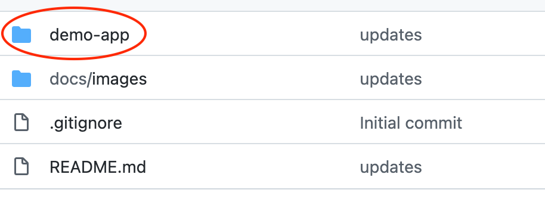</kbd>

---
### Install Argo CD

Argo CD is installed in Kubernetes just like your other applications. It's
recommended to install it in its own namespace. You can do so by running the
following commands:

```bash
kubectl create namespace argocd
kubectl apply -n argocd -f https://raw.githubusercontent.com/argoproj/argo-cd/stable/manifests/install.yaml
kubectl patch svc argocd-server -n argocd -p '{"spec": {"type": "LoadBalancer"}}'
```

The last command allows the UI to be accessible through your browser. You can
now visit [https://localhost](https://localhost) and see the Argo CD UI. Note
that since there is no SSL certificate you may get a "Not Secure" warning when
accessing the UI for the first time. If you get this warning you can specify
to proceed onto the Argo CD UI. Once loaded the UI should look something like
this:

<kbd>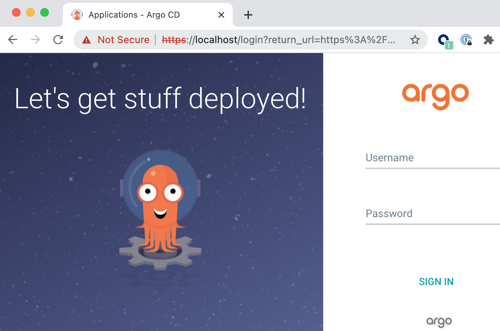</kbd>

The login username will be `admin`. There is an initial password that is
generated which you can access via the following command:

```bash
kubectl -n argocd get secret argocd-initial-admin-secret -o jsonpath="{.data.password}" | base64 -d && echo
```

After logging in you can change the password by clicking on the "User Info"
icon in the left menu and then the "Update Password" button on the top as
shown below.

<kbd>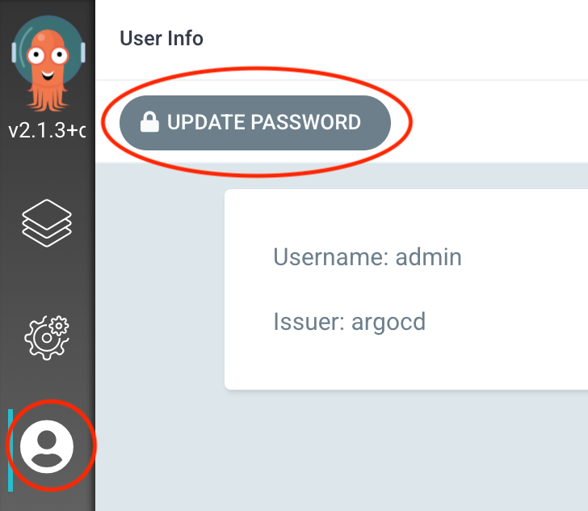</kbd>

---
### Add an Application

We will now add the application that exists in the forked repository to
Argo CD. In the Argo UI, click on the application icon on the left menu, then
click on the "New App" button on the top. We will now add configuration for
the application in the steps below.

<kbd>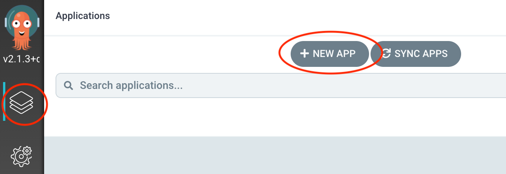</kbd>

---
#### General Config

Under the General config section, set the name of the application to be "demo"
and the project to be default as shown below.

<kbd>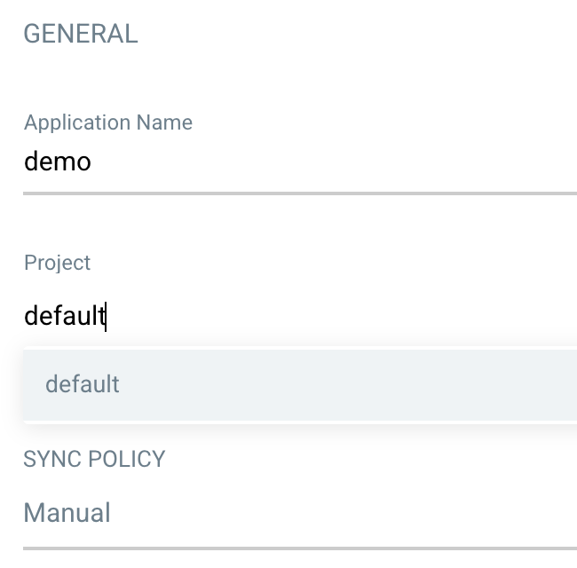</kbd>

We will leave the sync policy as manual for now, more on this option later.

---
#### Source Config

Scroll down to the next section which is source config. Here we will specify
where the application definition lies, which is our GitHub fork. Leave the
revision as HEAD.

<kbd>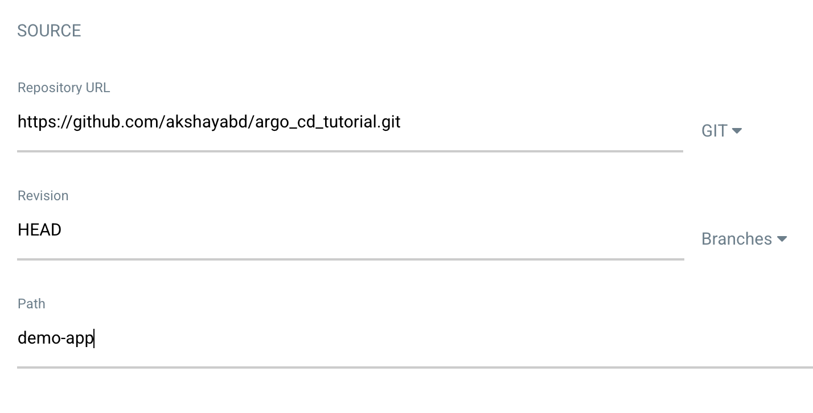</kbd>

---
#### Destination Config

For the destination cluster click on the text field and select the default
cluster. Set the namespace to be default.

<kbd>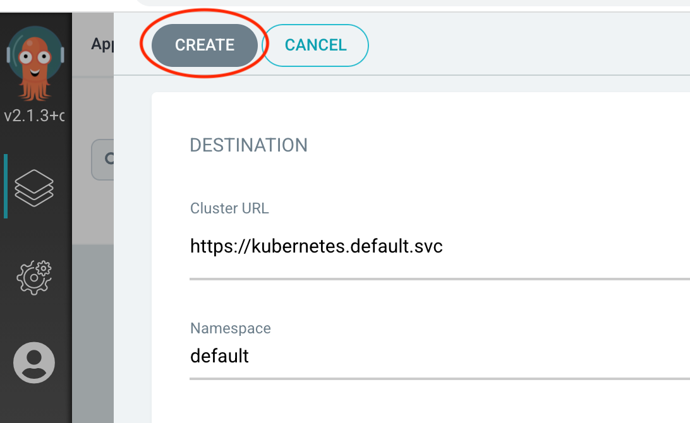</kbd>

Now click on the "Create" button at the top.

---
### Manually Deploy Application

After the application has been added to Argo CD, you will see a card for it.
In the card, there will be an indication that the application is "OutOfSync".
This means that the deployed version differs from the version in GitHub, in
this case because there hasn't been a deployment yet.

You can click on the "Sync" button in the card followed by the "Synchronize"
button to trigger a deployment.

<kbd>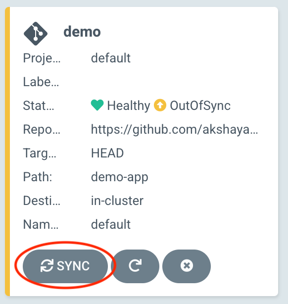</kbd>

After the deployment has finished the status on the card will change to
"Synced". You can click on the card to see more detailed information.

<kbd>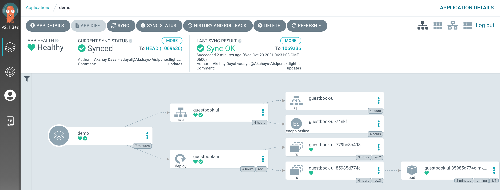</kbd>

---
#### View Deployed App

You can see the application deployed in the Kubernetes cluster:

```bash
$ kubectl -n default get pods
NAME                            READY   STATUS    RESTARTS   AGE
guestbook-ui-85985d774c-mkq46   1/1     Running   0          4m2s
```

Let's go ahead and do a port forward so we can access the application on port
8090 in our browser:

```bash
kubectl port-forward svc/guestbook-ui -n default 8090:80
```

<kbd>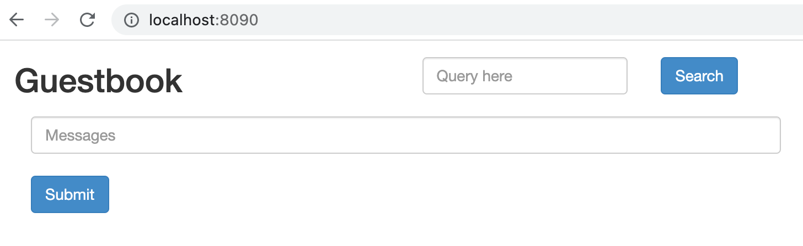</kbd>

---
### Modify Application Configuration and Re-Deploy

Now let's say a new version of the application was built. Edit the
demo-app/guestbook-ui-deployment.yaml configuration in GitHub with the
new image that's available as shown below.

<kbd>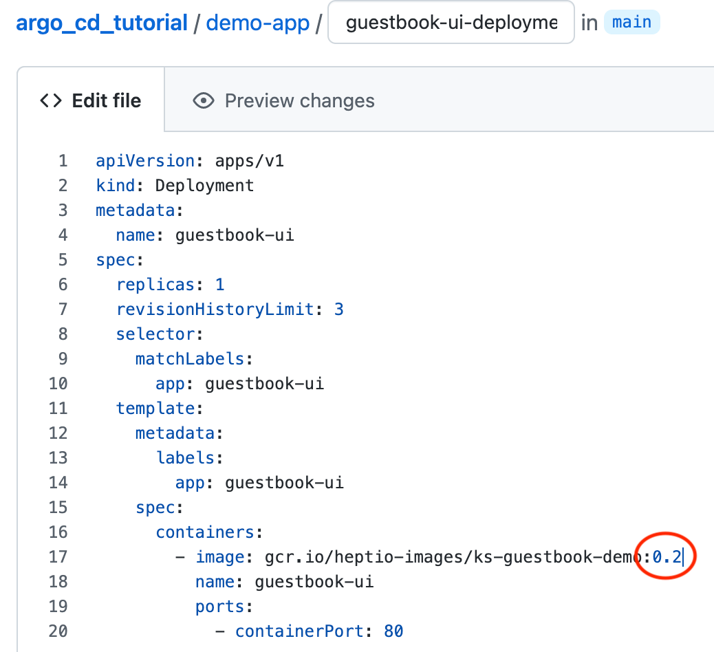</kbd>

After you have committed the change you can return to the Argo UI and go to
the application card. You can hit the refresh button and you will see that
Argo recognizes the application is out of sync. Alternatively if you wait a
little Argo will automatically detect this without you needing to click on
the refresh button.

<kbd>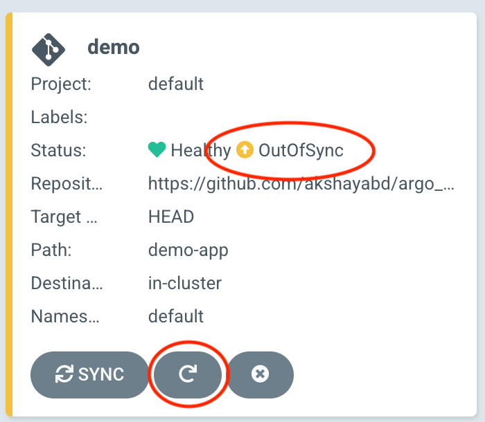</kbd>

Click on the sync button again to deploy the new verion of the application.
Start the port forward again:

```bash
kubectl port-forward svc/guestbook-ui -n default 8090:80
```

In the browser you will now see the application page looks different.

<kbd>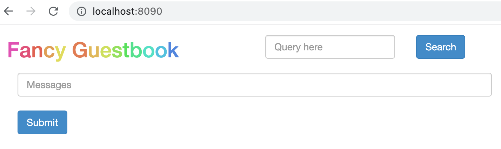</kbd>

---
### Automate Deployments

Say you wanted your deployments to automatically trigger whenever there was
a configuration change for the application in GitHub. In Argo CD this is
straightforward to setup.

Click on the application card and then click on the application details
button on the top.

<kbd>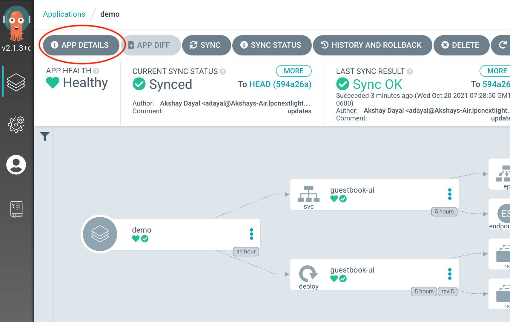</kbd>

Now scroll down to the sync policy section and click on the enable auto-sync
button.

<kbd>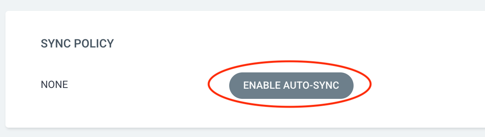</kbd>

Now edit the demo-app/guestbook-ui-deployment.yaml configuration again in
GitHub and change the image version back to 0.1.

<kbd>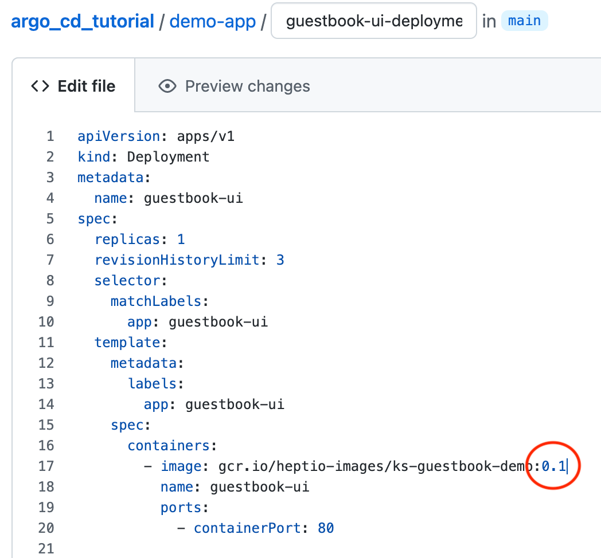</kbd>

After a few minutes Argo CD will automatically trigger a deployment and you
will see the old version of the application deployed again.

---
### Next Steps

In this tutorial we covered how straightforward it is to get started with
Argo CD and use it for GitOps deployments. It has a modern user experience
and many teams that deploy applications to Kubernetes love using it.

As a next step I suggest installing Argo CD in a staging cluster and try
deploying some low risk applications with it. For that I would recommend
installing it for
[high-availability](https://argo-cd.readthedocs.io/en/stable/operator-manual/installation/#high-availability)
and get a feel for how a production setup looks like.

Eventually your operations team might manage Argo, the community has plenty
of documentation for them to understand how the service works. A good starting
point is the
[architecture docs](https://argo-cd.readthedocs.io/en/stable/operator-manual/architecture/).


